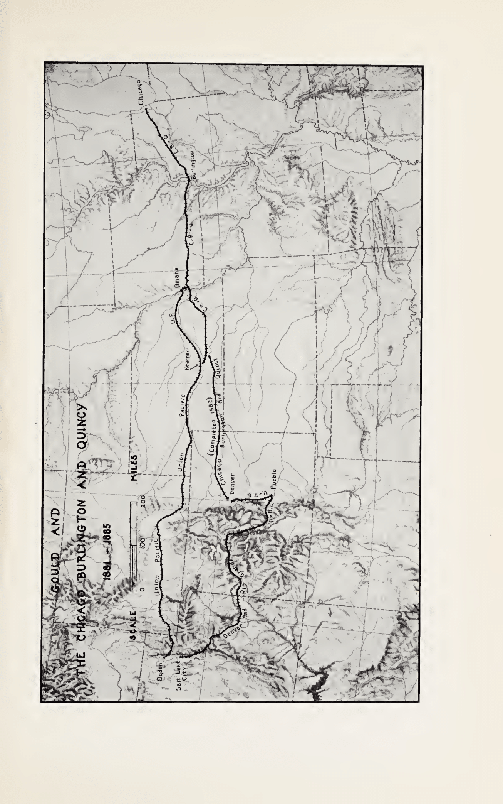

# Chapter XII - Gould Battles C. E. Perkins

While on the eastern railroad chessboard, Gould encountered the hesitant and shifting personality of Vanderbilt, on the western end he clashed headlong with the sturdy and vigorous leadership of Perkins. While some of Perkins's activities have already been examined in a previous chapter, it is essential at this point to sketch his character more comprehensively against the framework of railroad relationships in which he and Gould acted as main characters in the dramatic corporate and territorial conquests in the years beginning with the railroad boom of 1879.

Perkins was one of the business statesmen of his day. He had neither the flair for dramatic action that characterized Gould nor the penchant for ceaseless publicity of the widely advertised "Empire Builder" of the Northwest—James J. Hill. Neither was Perkins an independent leader in his own right as a majority stockholder nor as a leader of a substantial minority interest. Prior to his elevation to the presidency of the Burlington in 1881, he could rarely move independently of the views of a number of stalwart forceful and influential men on its board. Regardless of his personal judgments, therefore, it was impossible for him to move with the speed and dexterity of Gould. Perkins, furthermore, by 1880 had not yet attained a position of executive leadership in railroad affairs; and in this respect he was unlike his arch-competitor, Gould. It was necessary as superintendent and later as vice president of the B. & M., and subsequently as vice president of the Burlington itself, to harmonize and co-ordinate his views with those of his peers and superiors. He exerted little influence in the formation of the early Burlington line between Chicago and the Mississippi River and in its later extension to the Missouri River at Council Bluffs.

Despite the fact that after the panic of 1873, Perkins's judgment came to be increasingly solicited and respected, the dominant factor in laying down the managerial policies of the road was that of Forbes. Forbes's mind was constantly haunted by the losses which had been incurred as a result of the overexpansion in the boom years from 1868 to the panic. As a holder of every railroad stock except the Union Pacific,[^013_1] his losses must have been heavy. He was sarcastic and even cynical in his comments on promoters and bankruptcy-stricken railroad enterprises. His idea was stability, to be achieved by agreements among railroads to respect each other's territory. When he joined the Burlington's board his first step was to say to the Burlington and the Rock Island: Let us make the public pay a fair dividend, try to agree on a division of territory, and not intrude on each other's territory.[^013_2] In charge of the corporate destinies of the Burlington, he was almost always in dread of extensions and acquisitions.[^013_3]

Forbes did not modify his cautious policy until Gould's moves in the eighties forced a change upon the Burlington management. In defending his conservative actions over the previous decade, Forbes wrote that while the policy of respecting each other's territory had hitherto worked well, the activities of Gould in "making combinations in all directions" made it necessary for the Burlington in self-defense to combine with the Rock Island and defy Gould and Vanderbilt and "all other outside influences."[^013_4]

Perkins however recognized as early as 1877 that the time had come for a change. He saw, as had the Pennsylvania management ten years before, that it was unsafe for a road to depend for traffic connections on alliances with independently owned and managed railroads. In a series of comprehensive reports and memoranda characterized by intimate knowledge and clear thinking, he analyzed the strategic location of the Burlington and the necessity for taking action either by acquisitions of existing properties or by construction of additional mileage to complement the system and to unify and integrate the property.

His recommendations, while an executive of the B. & M., were for years not accepted by the Burlington management; but under the spur of Gould's belligerence, they finally became its settled policy. After much hesitation and reluctance, the Burlington under the leadership of Perkins finally launched out in the great policy of expansion which carried it to the foot of the Rocky Mountains at Denver and north and west in a wide area in Nebraska and Wyoming to a connection with the Hill lines in southern Montana. Although Perkins was not the father of the Burlington's stem of the sixties, he was surely the creator of the Burlington system of the eighties.

In enlarging the road by acquisition and construction, however, Perkins did not show the same genius for financial trading which characterized the activities of Gould. He could not map out a plan of acquiring securities at low prices in order to build up a system which was strategically essential to a well-rounded program of system building. Neither did he have the ability to negotiate for securities carrying control of desirable properties and of concluding trades rapidly in a period of general business uncertainty. Perkins was too keen a student of operation and administration, and too familiar with the physical necessities of railroads to reach a snap judgment on the strategic value of a desirable property. Exhaustive examinations made by himself and his associates preceded his decision to expand. Even when acquisitions were essential in self-defense against attacks made by others, the necessity for thorough reports was not overlooked.

Once his mind was made up, he acted decisively though not obstinately. In the midst of changing circumstances, he at times changed his mind, the better to accomplish a final result. However, once he recognized that a given policy was sound, and necessary to the achievement of a particular objective, he no longer hesitated. His execution of the project was carried out without fear or compromise, and no threats could move him. Next to Cornelius Vanderbilt and Huntington, Perkins was the most determined and redoubtable foe that Gould met in his business career of railroad expansion.

While the gloom of the depression in the seventies was still thick, Perkins's mind was turning to the immediate and future status of the Burlington as a first-class railroad system. The Burlington was financially secure; its debt was low, its earnings stable, and its stock was paying dividends. However, new forces were in the making and in a number of memoranda Perkins reduced to writing his ideas on the railroad network as they appeared to him toward the end of the depression in 1878 in the Mississippi and Missouri Valleys. They have a significance far greater than their value to the fortunes of the Burlington road and even to the country's railroad properties as a whole. The main line of the Burlington at that time extended from Chicago to Quincy with an offshoot to Burlington. From that point the lines extended through southern Iowa reaching the Missouri River at Council Bluffs and connecting also at Plattsmouth with its Nebraska affiliate. The system lines extended north to Council Bluffs in part by trackage over the Council Bluffs railroad. At Quincy the Burlington connected with the Hannibal which extended across Missouri to St. Joseph and Kansas City. The Burlington also interchanged traffic with the Kansas & Texas at Hannibal a few miles south of Quincy. The road was a desirable outlet for the southwestern business of lower Kansas, southwestern Missouri, the Indian Territory and Texas. The Kansas & Texas did not, however, reach Kansas City.

From upper Mississippi River points three unfinished lines had been projected into the area served by the Burlington. Each had encountered financial difficulties and had been precipitated into receivership. The traffic on the first road, the Quincy, Missouri & Pacific,[^013_5] was "very light."[^013_6] If extended farther west, it would however penetrate southern Iowa, served exclusively by the Burlington. The second road, the Missouri, Iowa & Nebraska,[^013_7] was launched under auspicious circumstances with support of reliable capitalists, including Carnegie and Smith (the influential banker of Columbus, Ohio), both of whom served on the board of directors, and with the reported support of the Pennsylvania Railroad.[^013_8] The third road, the Burlington & Southwestern,[^013_9] was projected as a competitive line of the Hannibal. In addition to its main line from Burlington, Iowa to St. Joseph, Missouri, another extension was to be pushed southward to Kansas City, and still another further south to serve southwestern Missouri. Like the other two small lines the road was not finished, and by 1878 it had been extended to a point one hundred miles away from Kansas City. And like the other two lines, it was also in receivership. Perkins was convinced that the Burlington must have a Kansas City connection and must control also the country between its Iowa lines and the main line of the Hannibal. To accomplish this it would be necessary to acquire the Quincy, the Iowa, and the B.S.W. If these roads were not taken they would gradually push on to trouble the Burlington. "If we do take them now," he wrote, "when they are bankrupt and before others are awake to the value of that region, we control that country and can extend these roads at our leisure." After discussing alternative policies, Perkins concluded that it was desirable also for the Burlington to acquire control of the Hannibal.[^013_10]

Such were the well-conceived plans of Perkins, recently elected vice president of the Burlington. They were not, however, the plans of Forbes and the board of directors. When Gould in the summer of 1879 invaded the Burlington territory through his capture of the Wabash and the Kansas City, the interrailroad competitive situation was still the same. The Burlington had bought control of none of the local or through roads, and had made no definite proposals for their acquisition.

In 1879 Gould moved to acquire control of almost all of these lines. Between the summer of 1878 and the spring of 1879, the owners of the Quincy entered into negotiations with both Gould and Perkins. Little is known of the Gould proposals. It seems that his bargaining tactics were shifty and difficult to follow. One of the Quincy men told Perkins late in June that "they were not solid in their love for Jay Gould & C.—," and Perkins observed that the Quincy people began to see how Gould had pulled the wool over their eyes.[^013_11] Nevertheless Gould finally acquired control by a lease to the Wabash. With the Wabash in possession of one of the three stubs, Perkins believed that the probability of its acquisition of the others would be lessened.[^013_12]

Perkins's judgment proved to be incorrect. Although one of the other short lines—the Iowa—was not as valuable to the Burlington as the others, the battle for control turned out to be significant and dramatic, and ultimately paved the way for a territorial understanding between the Burlington and the Wabash in southern Iowa and northern Missouri. By November, 1879, the Burlington had acquired enough of the bonds to lead Perkins to conclude that the trade was practically closed. Gould, however, discovered that the general manager of the Iowa, who owned a large interest in the Peoria—the line connecting with the Iowa at Keokuk—as well as a large block of the Iowa's bonds, was anxious to promote a new through line consisting of the Peoria and the Iowa. Perkins observed the interest of the Iowa's manager and pointed out to Forbes that probably the Burlington could acquire that road only if it bought at the same time control of the Peoria. Though the Peoria would make no positive contribution to the earning power of the Burlington, defensively it would be of considerable aid. The Peoria, Perkins pointed out, crossed the Burlington at four places, where it made rates and demoralized business generally. To get rid of this competition would be a considerable gain.

Gould early in 1880 succeeded in convincing some bondholders, who had agreed to sell to the Burlington, to sell instead to the Wabash.[^013_13] His ability to secure control over the Iowa was the result of his understanding of the ambitions of the Iowa's general manager to secure a new line from Omaha to the east, of which the Iowa and the Peoria were constituent parts. A plan between the Wabash and the Iowa was arranged in which both agreed to extend the line west to a junction with the Wabash, and to exchange the securities of the short line for those of the Wabash, providing the directors and shareholders of both roads approved. If such approval could not be secured, then the Iowa obligated itself to lease its line to the Wabash. A number of other provisions were inserted by which the bondholders were guaranteed a fixed interest and afforded the hope of securing additional contingent interest upon some income bonds. In response to the Iowa manager's fear that the company might not be able to complete the line because of legal obstacles that might be presented by its minority bondholders or stockholders, the Wabash, in the event of such contingency, accepted the responsibility of completing the extension. Although this ingenious contract was signed by the president of the Peoria, the chairman of the executive committee of the Wabash, and by the trustees for the reorganization of the Peoria, the contract bears all the earmarks of the trading genius of Gould.

By March, 1880, Gould had acquired control of both the Iowa and the Peoria. No sooner had he obtained possession than he decided to extend the former to the Missouri River and thus invade the territorial preserves of the Burlington. The new line in conjunction with the Wabash would make a reasonably short route from Omaha to Wabash points between St. Louis, Peoria, and Toledo.

To the Burlington the loss in local Iowa traffic from the proposed westward extension of the Iowa was far more important than the loss of through traffic. This local business was both large and profitable. Indeed the two-hundred-mile stretch east of the Missouri River was the heart of the Burlington territory, and was described by a railroad authority as "one of the most productive districts in the world."[^013_14]

Gould's invasion of this territory was therefore a vital thrust at the pillars of the Burlington's earning power. Perkins made it clear to Gould that the Burlington would fight if he carried out his competitive threat. To permit a big company like the Wabash to knock the Burlington down without hitting back, declared Perkins, would be fatal and would only cause others to do likewise. The best way to strike the Wabash, he thought, would be to parallel the road from Peoria east to the state line and there connect the Burlington with the Pennsylvania Railroad.[^013_15]

While the battle between Perkins and Gould was thus being joined in southern Iowa, important developments were taking place with respect to the Hannibal—an important competitor of the Wabash. In the summer of 1879 the president of the Hannibal, fearful of the strength of the Wabash, proposed to Perkins that the Burlington lease the Hannibal upon the basis of 40 per cent of its earnings. The specter of Gould crossed his mind; he did not know whether Gould had secured a controlling interest in his road, or whether a contest between Gould and himself was in the offing. He therefore thought that no one, not even the members of the two boards, should know that he and Perkins were conferring. At the annual election in early November, Gould and Sage were elected directors of the Hannibal. Although Gould did not have a controlling interest in the stock, his election to the board was forced upon the Hannibal under the cumulative voting laws of Missouri.[^013_16]

The election took place at about the time that Gould acquired the Central Branch and the Missouri Pacific. The successive corporate acquisitions of Gould put the Burlington in a dangerous position. To all appearances its lines were almost completely shut off from access to the lower Missouri Valley below Council Bluffs. The Wabash had secured control of two of the three unfinished stub lines which threatened to invade the rich Burlington territory in southern Iowa, and Gould on behalf of the Wabash was dickering for control of the third line. Ownership of the latter would provide the basis for a new line from Burlington territory in the upper Mississippi Valley to Kansas City.

Meanwhile the extent of Gould's control over the policies of the Hannibal was not immediately clear, although prudent management dictated the advisability of preparing for the worst. And the worst was the Gould exploitation of the road with its short line to Kansas City and its valuable terminal facilities. When the news came in early November that Gould had purchased the Missouri Pacific it seemed momentarily that the worst had indeed occurred. Something like consternation struck the camp of the Burlington. "Gould moves so rapidly," exclaimed Perkins, "it is impossible to keep up with him with Boards of Directors."[^013_17] He wondered how far Gould would try to use this power in order to whip other roads into subjection. It would be something of an undertaking, he thought, for either one of these properties to fight Gould single-handed. Perkins was sounding a call for united action against the common enemy, his appeal sounding very much like those made by Churchill in 1939 and 1940 to the neutral countries in western Europe to unite against the common enemy. The rule of self-help was followed in 1939, just as it was in the railroad battles of 1879 and 1880. If Gould should join wholeheartedly with Vanderbilt (Perkins was writing at the time when the Gould-Vanderbilt negotiations for a Lake Shore traffic contract were under consideration), it would make trouble for all the roads. In such an event an alliance with the Pennsylvania would be a natural result, but Perkins had it on good authority that Gould had joined with T. A. Scott, president of the Pennsylvania, in the construction of the Texas & Pacific extension to El Paso, and what that union of interests implied, Perkins did not know.[^013_18]

Of one thing Perkins was certain: that the Gould control of the Union Pacific and of other short lines made it important to do something toward the purchase of the Council Bluffs. This road—another Joy property—had long served as an important factor in the traffic of the Burlington in western Iowa and Missouri. Extending from Council Bluffs to Kansas City, Missouri, it gave the Burlington access not only to the important river gateways of St. Joseph, Atchison and Leavenworth, but also by trackage rights afforded it a convenient line into Council Bluffs.

Toward the end of the depression of the seventies, the growth of these lower Missouri River cities had taken a surprising spurt. The Burlington management recognizing the value of the road had long endeavored to acquire control. Shortly after becoming president of the Burlington in 1878, Forbes, desirous of minimizing risks, opened negotiations for a lease based upon its earnings, and the opportunity to acquire the road at a reasonable price slipped by. Its stock could have been bought at one time for little or nothing by guaranteeing the bond interest.[^013_19]

When Gould almost a year later bought the Missouri Pacific, the Council Bluffs was still independently owned. Gould made an immediate bid for control, and an officer of the Union Pacific informed at least one newspaper reporter early in December that within forty-eight hours Gould would own the road and shut the Burlington out of Council Bluffs.[^013_20]

This officer however was talking without full knowledge of the facts. Perkins recognized the strategic importance of the Council Bluffs line, and had little difficulty in convincing Forbes of the necessity of acting promptly to secure control. In late November, shortly after Gould's purchase of the Missouri Pacific, Perkins initiated an exhaustive investigation into the merits of the line. A steady stream of reports from officials of the Burlington and the Council Bluffs, and of outside parties as well, supplied Perkins with the facts upon which the Burlington management should act. Against the advantages to be realized in the purchase of the road—advantages that have already been summarized above—was the heavy cost of the road. Only a few years before, the company's income bonds and common stock had sold at nominal levels, and prior to 1879 the common stock had earned practically nothing. Early in the negotiations the traffic manager of the Burlington had expressed the thought that the purchase of the road on the basis of about $30,000 a mile would be self-sustaining; but less than two weeks later the assistant general manager had no hesitancy in approving the purchase of the road at about $50,000 a mile. This looked like a large sum, he added; but, he continued, "I believe we had better do it rather than let it go into the hands of other rival lines."[^013_21] A new road from Council Bluffs to Kansas City could have been built for approximately $21,000 a mile. The price which the Burlington finally paid for control, $125 (in its own stock) for the stock and income bonds of the acquired road,[^013_22] was probably the highest price in terms of asset value and earning power which up to that time the Burlington had ever paid for control of any road. The Burlington's hand was forced. It was now defensively following in the footsteps of Gould—buying roads with poor earnings at high prices.

By this purchase the Burlington had at least kept open one road to Kansas City. On the other hand, the Burlington after a prolonged contest lost control of another friendly connection with which for some years it had interchanged traffic to and from Texas and the Southwest. Despite this strategic position and the heavy volume of business, this road—the Kansas & Texas—fell a victim to depression influences. In an effort to stave off receivership it made a valiant effort to reach a voluntary agreement with its bondholders, offering to fund part of the interest in the form of preferred stock.[^013_23] This and other plans were unsuccessful and finally a receiver was appointed. The receivership however lasted only a short time and was succeeded by one of those unique schemes arising so often from desperate financial necessity.

When the receivership was terminated the property instead of being turned back to its stockholders was placed in the hands of a trust company assisted by an advisory committee of seven. The road then issued income bonds to fund its past due interest and floating debt, the trust company agreeing to apply the revenue after operating expenses to the payment of interest.[^013_24]

The company in 1879 had a heavy debt outstanding consisting of more than $14,000,000 of consolidated mortgage bonds in addition to a small amount of prior liens and a substantial block of junior income bonds. Of the consolidated bonds approximately $6,000,000 had been deposited with a committee of Dutch bankers. Both Gould and the Burlington management were in contact with these bankers known as the Amsterdam Committee. Gould had visited Amsterdam in the summer of 1879 in connection with his purchase of the Denver Pacific bonds, and there is little doubt that at that time he communicated with the Dutch bankers and exchanged opinions about reorganization plans.

Some months before this trip to Europe, competitive buying for the securities of the road took place and at least one New York newspaper declared that there was "no doubt" that Boston capitalists were buying its bonds and stocks.[^013_25] At the annual election a number of Burlington representatives were elected to its board, and reports even spread that the road might be leased to the Burlington. These rumors were not correct, though the Burlington's management was in touch with the Amsterdam Committee, competing with Gould for control of the property. This competitive rivalry, all things considered, should have ended in a victory for the Burlington, one of the most prosperous roads in the Middle West, and one of the few that had escaped the panic and depression years financially unscathed.

Despite these advantages the struggle to control the Kansas & Texas was lost by the Burlington. For against the group of capitalists was matched an individual who was constantly in search of strategic flaws and possessed of an almost bewildering knowledge of the intricacies of corporation finance. In view of the heavy debt of the Kansas & Texas, the Burlington management was not willing to pay anything for the common stock, and accordingly planned to acquire control through a mortgage foreclosure which would make the stock valueless. By the fall of the year the Burlington had finally made a definite offer, expressing its willingness to guarantee a return of 4 per cent upon the bonds. Forbes believed that the bondholders would take this guaranty of the Burlington in preference to a 5 per cent offer of the Wabash. He was savage in his attack on the Wabash guaranty proposals. "It is an edifying spectacle to see hungry capitalists hankering after guarantees of bankrupt roads by other bankrupts. It is like the blind leading the blind and the lame carrying the lame." The Burlington had no intention of competing with the Wabash "and other such adventurers" in a race to lend corporate credit to weak lines, even though the stockholders of the Kansas & Texas were urging an alliance with the Burlington.[^013_26]

In October, the Dutch bondholders finally declined the Burlington offer and insisted upon a 5 per cent guaranty.[^013_27] Even though these terms were attractive they believed that more could be secured from Gould, and in fact shortly after rejection of the Burlington's guaranty, the Wabash did offer them 6 per cent.

Shortly after the rejection of the Burlington offer, the price of the Kansas & Texas stock rose sharply in one day from 22 to more than 25, and on the next day to 29. Informed financial judgment could not understand the reasons for the sudden elevation of a stock which had long been considered as worthless. "It would require," remarked one commentator, "a very powerful microscope to discover one-tenth of that price in the present value of that stock."[^013_28] Gould's connection with the buying movement was of course unsuspected, and he was thereby able to repeat his experience earlier in the year with the Wabash, the Kansas Pacific, and the Kansas City. Looking for no bargains and taking the market price as representative of the values he sought to acquire, he bought at the market price and paid high prices which no conservative management would care to pay. It must be remembered, however, that he was an individual, acting in his individual capacity as a market trader, and risking his personal funds. Although the price was high, he achieved his major purpose of acquiring a majority of the stock of the road.

Gould's conquest of the Kansas & Texas was rapid indeed. By the following January he had installed his board of directors, and by May he had induced the stockholders to approve a lease of the property to the Missouri Pacific. The lease was an ingenious document conceived in the best tradition of Gould's financial technique. Under the terms of the contract, the lessee although agreeing to pay interest from the earnings realized by the lessor, guaranteed nothing; it agreed only to turn over any surplus in earnings to the lessor's shareholders. At any time and whenever the interests of the lessee so required, the lessee could return the property to the lessor. In making this lease the bondholders were not consulted, and they might therefore well challenge its legality. A foreclosure sale could still pass title of the property to the bondholders who could then trade with the Burlington. Gould was well aware of these possibilities, and he recognized that in order to insure the Missouri Pacific control of the Kansas & Texas, it was essential that the trust company return the property to the shareholders. In October, 1880, accordingly, Gould in his capacity as president of the Kansas & Texas tendered the trust company $800,000 in cash; this amount, together with an additional $250,000 cash in the lessor's treasury, was sufficient to honor the unpaid interest coupons, thereby removing the existing default. Gould therefore demanded restoration of control of the road to the stockholders. He informed the trust company that as soon as this restoration was effected, a fund of $5,000,000 already subscribed would be spent in realizing the company's original hopes of extending its line to the Rio Grande. In demanding the return of the property upon payment of the defaulted interest, Gould was on solid legal ground; and the court therefore ordered restoration of the Kansas & Texas to its stockholders. The request of Gould, as president of the road, for the return of its property, wrote the judge, "would seem to be a reasonable demand. . . ."[^013_29] Gould had now secured another notable victory without putting up any funds (since he could now sell the Kansas & Texas stock at a profit) without assuming any liability, and with the assumption of no corporate liability by the lessee, which he personally dominated.

The control of the Kansas & Texas was now in the hands of people who were not interested exclusively in its affairs and who had greater commitments in other roads with which the newly leased line was affiliated. The lessee nevertheless was given a blank check in dominating the lessor's policy, in construction of extensions by the lessor, in the diversion of traffic from the lines of the lessor to the lessee or of other lines in which the owners of the lessee were interested, and in the preparation of books of account in such a way as to increase or decrease public earnings in order to satisfy the paramount interest of the lessee. With the Missouri Pacific in control of the Kansas & Texas, the latter's business could be diverted from the Burlington to other Gould lines. Not long after the passage of control, for example, the Kansas & Texas, in face of the fact that the largest shippers preferred the Burlington, diverted almost all of its Texas-Chicago livestock to the Wabash.[^013_30]

By the end of 1880, therefore, the Burlington, as the result of its prolonged competitive contest with Gould, had succeeded only in the capture of control of the Council Bluffs, although it was probable that it might still be able to play some role in the determination of the policies of the Hannibal. That road meanwhile (for the year 1880) was trading about one-half of its interchange business with the Wabash.[^013_31] In view of the close relations which had for so long existed between the Hannibal and the Burlington, such a high percentage could have been secured only by diversion of business from the latter. The Hannibal furthermore threatened the Burlington with an extension of its line from Quincy to Chicago.

At the same time Gould was negotiating for control of the B.S.W. The Burlington officials, well acquainted with the condition of that road, refused to bid up its price even in the face of its possible acquisition by Gould. Forbes, cautious as ever, believed that the Burlington could take care of the Kansas City business by making some combination with existing roads. If, however, that proved to be impossible and the Burlington was forced to build, the new road would have to be something a good deal better than the B.S.W. could "any how be made." If, he concluded, there was any reasonable chance of the Burlington being required to build a good road to Kansas City, then it had better avail itself of the then existing low prices of money to build immediately and take the chance of acquiring the road later.[^013_32]

By the summer of 1880 it had become clear to Gould that, in view of his control of the two St. Louis-Kansas City short lines, a third outlet to Kansas City in the form of a financially unproductive property was not essential to his system-building plans, and although no agreement with the Burlington had yet been made, a sale to Gould and his group was off. The relationships between the Burlington and the B.S.W. were such as to make the Burlington feel safe that the B.S.W. would pass into its hands at a reasonable price.

Under these circumstances Perkins could take the initiative in the campaign of challenges and counter-challenges which charged the atmosphere of personal and corporate negotiations between Gould and Perkins and between the Burlington and the Wabash. Perkins threatened to get control of the B.S.W. and build an extension to Kansas City if reasonable terms could not be made with the Hannibal, and Gould served a counter-threat that in that case the Hannibal would build to Chicago.

Despite their verbal exchanges, neither Perkins nor Gould for the moment made any aggressive moves. On both sides steps were taken to secure peace with honor, and to find a friendly way out of a threatened corporate war with the minimum injury to each of the contestants. Early in July Gould took the initiative by writing confidentially to Perkins that he thought the Burlington and the Wabash might get together to stop the Hannibal line to Chicago. In communicating this information to Forbes, Perkins suggested that if the Burlington could acquire control of the B.S.W. and buy the Iowa from the Wabash, the country could be divided so that both contesting systems could make a profit. There was more profit, wrote Perkins, to the Burlington and the Hannibal in maintaining the one line to Chicago and Kansas City than in extending the B.S.W. west and the Hannibal east.[^013_33] Perkins in his reply to Gould nevertheless continued to advert to the danger of the Hannibal's Chicago extension.[^013_34]

These friendly interchanges were followed by a meeting between Gould, Perkins, and Dillon of the Union Pacific. At this meeting these three "in a very friendly spirit," to use the language of Gould, arranged all matters west of the Missouri River.[^013_35] Gould reported that he had advised the Hannibal to make what he considered "a perfectly fair adjustment" with the Burlington, and had recommended that the Wabash make a strong alliance with the Burlington at Peoria such as Perkins "intimated would be satisfactory." Though the Wabash people said they were committed as part of their purchase of the Iowa to include the extension across the state of Iowa to a connection with their Omaha line, they agreed on the other hand that they would go no further than the extension to Omaha, thus protecting the Burlington system in the rich country of southern Nebraska. This was as far, said Gould, as he had been able to commit the Wabash people up to this time, and he suggested therefore that T. J. Coolidge, a member of the Burlington board and president of the Atchison, who had arranged the Gould-Perkins-Dillon meeting, come to New York to consider these problems with the Wabash directors in order to work out a satisfactory adjustment.

Perkins meanwhile had talked with the leading Hannibal stockholders and officials of the road, and although Gould was ready to conclude an agreement upon the basis of the status quo, the Hannibal stockholders were not satisfied and as an alternative suggested that the Burlington buy a controlling interest in the Hannibal stock. Perkins, however, was not interested and remained confident that a trade could be made on the basis of the status quo for a three-year period, an interval sufficiently long to enable the Burlington to consider maturely the idea of building an extension to the foot of the Rockies.

All these prolonged negotiations, however, achieved no immediate results. Both camps were probing each other's strength and weakness, and neither was prepared to make the concessions necessary to a trade. Perkins revealed not the slightest intention of compromising the main objective of keeping the Wabash out of its Iowa territory. Neither was Gould prepared to surrender his objective of securing a new short line for the Wabash system. By September Perkins concluded that the negotiations would lead nowhere and that it was necessary for the Burlington itself to take the offensive in order to bring Gould and the Wabash to terms. Perkins therefore informed Humphreys of the Burlington's intention to build the road paralleling the line of the Iowa, and Humphreys replied that he would build lines in Nebraska.[^013_36]

This defiant attitude of Humphreys—and Humphreys to the realistic mind of Perkins reflected the policies of Gould—had to Perkins only one meaning: Gould either could not or would not make peace, and since it was unlikely that he could not make peace, Perkins concluded that he simply would not. Despite the imminence of the railroad construction war, Perkins still had some hope. He believed there was one, and only one, compromise left that both parties could afford to accept. The Wabash had insisted that it wanted only a through line to connect the line of the Peoria with Omaha, and that it had no design upon the Burlington's local business. The Burlington also wanted a through line through southern Iowa connecting with the Burlington's lines at the Mississippi River junctions in order to facilitate the movement of its traffic from the Southwest and from southern Nebraska. The needs of both lines would be served by the construction of one road to be owned half and half by each of the two parties and to be managed under a contract which would protect the Burlington against branches that would interfere with its local traffic and tend to demoralize rates. The local business on the new line would belong one-half to each party.[^013_37]

Almost at the same time Gould in a conversation with Coolidge had made a similar suggestion. He developed the idea that the connection of the Iowa could be owned in common in return for an agreement by the Burlington not to invade Colorado or Kansas for a period of ten years. Perkins admitted that to let the Wabash come into the Burlington's Iowa territory, even on joint ownership "without our building anything in retaliation [was] a dangerous precedent—& a backdown." He was ready, however, to make this agreement as the easiest way out of the difficulty. If, however, said Perkins, he were as rich as Vanderbilt and owned half of the Burlington, he would fight Gould and whip him; but he wasn't certain that the mass of Burlington stockholders would favor such a program.[^013_38]

Meanwhile, Coolidge, frightened by the renewed threat of the outbreak of a competitive construction war, had also suggested to Perkins that some compromise be worked out with the Wabash. Although Perkins was ready for business on any fair basis, he questioned the wisdom of any compromise if it involved the extension of the Wabash through Burlington territory. Even if the Wabash did not interfere with the Burlington's local traffic, a compromise, in Perkins's judgment, might be regarded as a bad precedent. But if Coolidge's suggestion meant the negotiation of "a general treaty," by which the Wabash, the Burlington and the Union Pacific would guarantee the status quo, and by which the Burlington would agree not to extend its lines to Denver in exchange for a "fair share" of the business of the Atchison and of the Union Pacific, a basis could be laid for a general all-around understanding.[^013_39]

Perkins's perspicuity and his statesmanlike sense of business realities led him to make a fruitful suggestion striking directly at the heart of the subject. "Mr. Gould's power [is] so great and his influence [extends] over so many corporations that I think he personally should also be party to such a contract if practicable."[^013_40] Gould however was too shrewd and too familiar with the tactics of trading ever to commit such a blunder. He rarely assumed any personal responsibility for contracts which expressed his personal judgments of corporate policies, but rather made them through the instrumentality of a corporation which apparently was the one most directly affected. Usually other companies in which he had stock interests, directly or indirectly, were also affected, and his interestsin such concerns frequently made it essential to change the contract, or even to nullify it. In substance, although not in form, Gould was usually the most important factor in the contract but personally he never appeared as such. The Union Pacific contracts were signed by Dillon as president; the Western Union contracts were signed by Green as president; and the Wabash contracts by Humphreys as president. Perkins's suggestion for a Gould signature to any agreement which might be made was therefore sound, but it passed unheeded by Gould.

Perkins moreover was not certain that Gould meant business and he still feared a renewed contest for territory. If this contest continued, insisted Perkins, "the fences [were] down"; and the company which moved slowly or timidly must in the end be submerged. To protect corporations from each other, it was important to respect territorial rights. Throwing down the gauntlet indirectly and without naming Gould, he declared that the Union Pacific had been among the first to insist upon the recognition of the rule of territorial rights; and the Burlington had accepted it. The present disagreements with the Wabash, he declared, had grown "wholly out of its unwillingness to accept this rule."

In a burst of personal frankness worthy of Pepys' Diary, Perkins related that the Burlington was not entirely blameless, since it should have insisted upon applying this rule one or two years before, when the Wabash first invaded the Burlington territory by building an extension to Council Bluffs. Applying this to the Burlington, Perkins stated that that road could not accept the rule west of the Missouri, for example, if there was to be no such rule east of the river. If therefore the Wabash extended into Burlington territory because it could get half of its business, then there was no territorial law, and the Burlington must then build to Kansas or Colorado or wherever it could find business.[^013_41]

The unyielding stand taken by Perkins finally impressed Gould. A meeting attended not only by Gould and Perkins but also by officials of the Union Pacific and the Wabash was held in New York from October 19 to October 22. No longer could Gould prolong negotiations by shifting the responsibility to the other two roads. No longer could he say that he had tried unsuccessfully to induce this or that official to do so and so. All policy-making officials were present, Dillon representing the Union Pacific and Humphreys the Wabash. The solution was found in the idea that had been independently suggested by both Gould and Perkins. The Iowa's extension was to be built by an independent company for joint account, the Wabash and Burlington putting in half the money and having an equal voice in its building and management. Each road felt that it was surrendering something. The Wabash believed that it was surrendering the business that it might have obtained by building new lines in Iowa and Nebraska, while the Burlington believed that it gave up much that might have been secured by going into Kansas and Colorado. The Burlington "knows" wrote Perkins, that by this compromise it must lose a certain amount of business which it formerly had. In the general territorial understanding the Burlington agreed to abandon opposition to the construction by the Wabash of a number of small branch lines; while the Wabash and the Union Pacific in turn agreed not to extend their lines into southern Nebraska. The Burlington agreed not to build to Denver, thus protecting the Union Pacific, and the Wabash agreed to build no more main or through lines in southern Iowa, thus protecting the Burlington.[^013_42] Despite the sacrifices made in the form of a loss of future potential business, the Burlington management had nevertheless secured what appeared to be a definite territorial settlement, an absence of competition on its rich local traffic in southern Iowa, and—what promised to be the grandest prize of all—the assurance of rate stability.

The superior business ability of Perkins, as compared with that of Vanderbilt, is revealed in the final outcome of this dispute which threatened to develop into such a far-reaching program of competitive and duplicate building in the territories of the Burlington and of the Wabash. Gould had forced Vanderbilt to follow a policy highly advantageous to Gould, personally, and also to his corporate interests. This policy, however, had not saved Vanderbilt from Gould competition. Perkins made no gestures. He made it known to Gould that if he acted to harm the Burlington, regardless of the harm done to the Wabash, Perkins would act to hurt the Wabash regardless of the injury to the Burlington. While Vanderbilt had twisted himself into an entangling alliance with Gould, Perkins sturdily maintained the corporate independence of the Burlington. Perkins made it clear to Gould and his associates that if any violation of the territorial agreement of October, 1880, was made, the Burlington would retaliate and invade the corporate domain of Gould's Union Pacific in Kansas and Colorado by extending its own line to Denver.

There is no doubt that Gould recognized the potential dangers arising from a Denver extension of the Burlington. The high rate structure of the Union Pacific was protected by the absence of competition in its local territory, a large part of which would be invaded and subjected to competition by a Burlington line. Gould's primary interest, however, was no longer in the Union Pacific. By the spring of 1881 he had sold out his stock and, in so far as his railroad interests were concerned, was most interested in his southwestern system. The peace agreement of October, 1880, afforded the Wabash the opportunity to build some small local extensions in southern Iowa. Gould taking advantage of this loophole, proposed early in 1881 to build a north-and-south line in Iowa across the Burlington territory to the state capital at Des Moines.[^013_43] Although this was a violation of the spirit if not the actual provisions of the agreement of the previous fall, the Burlington overlooked the incident.

There was still no certainty that the Burlington would ever push its line west to Denver and engage in competition with the Union Pacific. In the fall of 1880 there existed a difference of opinion on its board of directors with respect to the wisdom of such a connection. Some members believed the extension was essential to the welfare of the Burlington, and in fact inevitable; while others held the view that in the interests of harmony such an extension should not be built.

Neither Forbes nor Ames, however, could exert any control over Gould's activities in behalf of his new southwestern system. The Union Pacific was to Gould a secondary interest; while the Missouri Pacific, the parent of the southwestern roads, was his primary one. The Missouri Pacific extended from Kansas City to St. Louis, connecting at that point with a number of roads from Arkansas, Texas, and Louisiana. The main flow of the Union Pacific traffic, however, terminated at Omaha; and in order to tap this rich volume of business, Gould decided in the summer of 1881 upon building an extension of the Missouri Pacific from Atchison to Omaha.[^013_44] Such a line penetrating the territory west of the Missouri River would serve some of the richest Burlington counties,[^013_45] and might therefore encourage the Burlington to break with the Union Pacific and finally to push west to Denver. The first intimation of this new move by Gould came to the attention of Perkins in June of 1881, for in the middle of that month Perkins wrote a letter to Gould marked "Private," referring to reports concerning the intention of the Missouri Pacific to extend its lines into Nebraska.[^013_46] Gould informed Perkins a few days later that the reports were correct and that the Missouri Pacific had decided to extend to Omaha. Gould insisted that the proposed extension was necessary to perfect the system of the Missouri Pacific and to preserve a connection with eastern Nebraska and the Union Pacific at Omaha; and that the Burlington, since it had annexed two small independent lines over which the Missouri Pacific had formerly secured access to Omaha, had no right to object. Indeed, insisted Gould, since the Burlington's absorption of these lines, the business of the Missouri Pacific had "gradually shrunk to small proportions."[^013_47]

The danger of Gould's actions to the Union Pacific was obvious. For a number of years the Burlington had considered plans to extend its lines west from southern Nebraska to the foot of the mountains at Denver. Partly in deference to the views of Forbes and partly because of the repeated promises made by Gould to preserve inter-corporate peace—concessions and promises which sounded pleasant to the ears of conservative leaders in the Union Pacific and the Burlington camps, this project had been repeatedly postponed. The last promise of inter-corporate peace had been made by the Union Pacific in the agreement of October, 1880, an agreement which from the standpoint of the Burlington was designed to stabilize territorial competition in southern Nebraska. The peace was now about to be disturbed by an individual who, although exercising an influence on the policies of the Union Pacific, owned only a few shares of its stock. Gould's policy of extension through the corporate instrumentality of the Missouri Pacific was strongly opposed by Dillon, president of the Union Pacific, who declared in a letter to Perkins that the Missouri Pacific's proposed construction had been undertaken without his consent and against the protest of himself and of the Union Pacific's directors in Boston.[^013_48] Those directors who had stoutly maintained their conservative views, and who had always desired the maintenance of peaceable relationships between that road and the Burlington, set to work to prevent the Burlington from denouncing the 1880 territorial agreement, and to frustrate the Burlington's extension west to Denver. Frederick L. Ames, a leader of the conservative group of the Union Pacific, interviewed Sidney Bartlett of the Burlington board. Dillon followed with a letter to Bartlett in which he again pointed out that he had "earnestly" objected to the proposed construction of the Omaha line, and that it would be unjust to the Union Pacific to hold it responsible "for action taken which it could not and can not prevent and which it did not and does not favor."[^013_49] Approaches to the Burlington were also made by Vanderbilt who at that time had "a very large interest" in both the Burlington and the Union Pacific. He followed the line of reasoning developed by Dillon, and insisted upon the reasonableness of a point of view which permitted differences to arise between the two companies because of an "individual action" in which the Union Pacific had no interest and in which it took no part. Vanderbilt, ready as ever to conciliate, expressed his willingness to co-operate in protecting the mutual interests of both roads.[^013_50]

However, the day of conciliators and peacemakers had passed. Leaders on both sides refused to budge. Gould as president of the Missouri Pacific insisted that the Burlington had acquired the old Joy road on the east side of the Missouri River from Omaha to Kansas City, thereby securing an advantage over the Missouri Pacific in competition for the Omaha traffic. The Missouri Pacific, he insisted, was therefore "in a battle and it must free itself at any cost of money or peace."[^013_51] Perkins was equally firm and determined. In his earlier experiences with Gould he had been somewhat hesitant. After his initial contacts early in 1874, he had, however, maintained consistently an attitude of opposition to Gould's policies. Forbes, on the contrary, had championed efforts at reconciliation. Recognizing that his policy had failed, he was no longer willing to make peace overtures and he therefore rejected the conciliatory advances made by Vanderbilt. In forthright language, reflecting the determined convictions of Perkins, Forbes informed Vanderbilt that agreements "must depend not on their legal or technical validity, but upon the honest purpose and determination of persons participating in their formation, to live up to them."[^013_52] Perkins's policy of dynamic defense against the Gould policies in the form of a Burlington offense eventually won out in the Burlington camp. On July 20, 1881, the board resolved that the road's vice president, Perkins, be instructed to notify the Union Pacific that the organization of a company by some of its leading directors to build a road in eastern Nebraska was an abrogation of the agreement with the Burlington.

Although Gould recognized the determined character of the decision, he refused to make concessions, and indeed, in accordance with his usual policy, he decided to meet threat with threat. He insisted that if the Burlington extended its line to Denver, thus competing with the Union Pacific, Gould acting not through the Union Pacific whose interests were endangered, but rather through the Missouri Pacific, would transfer the latter's business between Hannibal and Chicago to the competitors of the Burlington. The Missouri Pacific would also build an independent line of its own to Chicago and extend a series of lateral lines into Nebraska. "We wish peace," wrote Gould to Perkins, "but we are ready for war if you insist on making it. Carrying out your menace of extending your line to Denver means war."[^013_53]

Perkins was equally firm and defied Gould to do his worst. The war threatened by Gould, Perkins replied, began not with any act of the Burlington but by the act of Gould and his associates in building a road "where the October agreement was intended for the present to prevent one from being built." It is true, he declared, that if the Burlington took no notice of the proposed Omaha extension, there would be for the time no war; but this was true of all threatened railroad or other wars where one party submits; "but responsibility for the war can hardly be charged to the party attacked if he refuses to submit." Gould's position as peacemaker was curtly rejected by Perkins. "As to who has been the peacemaker in the past and who is responsible for the present difficulty, the record speaks for itself. It shows that we have never received anything at your hands for which we have not given a very full consideration."[^013_54]

The course of the Burlington was now set. The policy of Perkins had won. All doubts about the Burlington's Denver line were now resolved. In preparation for the major change in policy involving the road in a broad expansion plan to the west, the executive management was changed. Forbes moved up to the chairmanship of the board and Perkins was elevated from vice president to president. He had always been the constructive and aggressive element in the company's directorate and managerial hierarchy. Now he was for the first time in full charge of the company's executive policies. The management, in the expressive language of a contemporary newspaper, had finally "put on their war paint."[^013_55]

The Burlington was ready for war. Despite the acquisition of several financially unproductive roads, its credit remained excellent. The margin of safety for its fixed charges was substantial, and it continued to pay dividends. The management therefore found no difficulty in financing the Denver extension, and construction once begun was carried on actively. By May of 1882 the last rail was laid and through trains ran from Chicago to Denver. Shortly thereafter, in the spring of 1883, the Denver completed its extension from Denver to Ogden. A new transcontinental route, competing directly with the Union Pacific, was thus established. Gould who was serving on the board of the Union Pacific thus seriously impaired its strength and earnings. The Colorado business, which since the Union Pacific's merger with the Kansas Pacific in 1880 was so largely controlled by the Union Pacific, was hereafter to be shared with the Burlington.

The Burlington extension also damaged the fortunes of the Wabash. The Union Pacific, controlling without competition the middle transcontinental line between Ogden and Omaha, distributed its eastbound business between the Iowa lines at Council Bluffs and the Gould-controlled lines at Kansas City. The Kansas City route was circuitous and not as desirable as the direct line to Chicago. Gould in control of the Union Pacific and of the Wabash, could, without danger of retaliation, route some of the former's business over the latter's lines east of Kansas City. With the Burlington soliciting traffic over the direct line from Omaha to Chicago, the competitive pressure exerted upon the Union Pacific to give the same standard of service made it difficult to continue to send any significant volume of business via the Kansas City gateway. The Wabash could not meet the service standard set by the Iowa Pool roads.

Furthermore, under this new competitive arrangement, the Union Pacific was forced to give its connections at Omaha, including the Burlington, more eastbound business. Only in this way could it secure a share of the westbound business of the Burlington and of the other Iowa lines. If it continued to send traffic east via Kansas City and away from Omaha, it would have to receive from the Wabash at Kansas City westbound, as valuable traffic as it delivered to the Wabash at Kansas City eastbound. The major trend of traffic through the Kansas City gateway was south and west and not north and west. The Union Pacific, therefore, was forced to deal preferentially to a greater extent than ever before with its Omaha connections, since thereby it secured more westbound business than it could by trading at Kansas City.

By renewing this competitive struggle with the Burlington, Gould injured both the Wabash and the Union Pacific. He succeeded however in selling his Wabash and Union Pacific holdings before these adverse results were reflected in published financial statements. Later he bought these stocks again. The problems which he inflicted upon the Wabash and the Union Pacific produced losses for both roads. By the fall of 1881, however, his railroad activities had assumed new shape, and he had become interested in still other properties. These new phases of his activities will be examined in the following chapters.

---

## Notes for Chapter XII

[^013_1]: Burlington archives, Forbes to Simpson, May 29, 1878.
[^013_2]: Ibid., Forbes to Lucius Tuckerman, March 20, 1880; also Feb. 14, 1880.
[^013_3]: Ibid., Tyson to Perkins, March 18, 1878, for example, observed in referring to the proposal to co-operate with Villard in acquiring the Kansas Pacific, that Forbes dreaded the idea of any more extensions; and, Tyson continued, that the Burlington could not forego the advantages which the troubles of other roads offered it of securing a large future business. Tyson also remarked that if the Kansas Pacific could be controlled, the Atchison could also be secured.
[^013_4]: Ibid., Forbes to Tuckerman, March 20, 1880.
[^013_5]: Known hereafter as the Quincy.
[^013_6]: Ibid., T. J. Potter to Perkins, Jan. 13, 1886. This observation was made by an informed traffic officer of the Burlington in the middle eighties after the rapid increase in traffic in the Middle West. Clearly the traffic density in 1878 was no higher than it was in 1886.
[^013_7]: Known hereafter as the Iowa.
[^013_8]: Burlington archives, Perkins to Brooks, Feb. 6, 1871.
[^013_9]: Known hereafter as the B.S.W.
[^013_10]: The long memorandum in which he outlined his views was undated; but from internal evidence in the document, it appears that it was written in 1878.
[^013_11]: Burlington archives, Perkins to Forbes, June 29, 1879.
[^013_12]: Ibid., May 30, 1879.
[^013_13]: Ibid., Perkins to W. W. Morsman, Feb. 1, 1886.
[^013_14]: R. R. Gaz., March 26, 1880, 169.
[^013_15]: Burlington archives, Perkins to Forbes, Aug. 30, 1880.
[^013_16]: Ibid., Nov. 8, 1879.
[^013_17]: Ibid., Nov. 19, 1879.
[^013_18]: This was the opinion of Perkins expressed in ibid., Perkins to Forbes, Nov. 12, 1879.
[^013_19]: Chicago Times, Dec. 2, 1879.
[^013_20]: Burlington archives, Potter to Perkins, Jan. 4, 1880. The recommendation for the purchase of the road at about $30,000 a mile was made in a letter from Smith, Burlington traffic manager in Chicago, to Potter, under date of Dec. 24, 1879.
[^013_21]: Ibid., Forbes to Charles Merriam, May 7, 1880.
[^013_22]: R. R. Gaz., Nov. 28, 1874, 468.
[^013_23]: Poor's Manual of Railroads, 1878-9, 820-1; New York Tribune, Feb. 1, 1879.
[^013_24]: New York Tribune, March 10, 1879; see also Phila. North American, March 12, 1879, and April 12, 1879.
[^013_25]: Burlington archives, Forbes to Geddes, Aug. 28, 1879.
[^013_26]: Ibid., telegram, W. J. Ladd to Perkins, Oct. 14, 1879.
[^013_27]: New York Tribune, Oct. 22, 1879.
[^013_28]: St. Louis Republican, cited in R. R. Gaz., June 4, 1880, 310.
[^013_29]: New York Tribune, Nov. 18, 1880.
[^013_30]: Burlington archives, E. P. Ripley to S. Frink, general freight agent, Missouri Pacific, March 24, 1882.
[^013_31]: Ibid., J. S. Cameron to Perkins (month not given) 1880.
[^013_32]: The above quotation from, and the summary of the views of, Forbes are taken from ibid., Forbes to William Endicott, July 11, 1880.
[^013_33]: Ibid., Perkins to Forbes, July 7, 1880.
[^013_34]: Ibid., Perkins to Gould, July 7, 1880.
[^013_35]: Ibid., Gould to T. J. Coolidge, Sept. 10, 1880.
[^013_36]: Ibid., Humphreys to Perkins, Sept. 13, 1880.
[^013_37]: Ibid., Perkins to Forbes, Sept. 16, 1880.
[^013_38]: Ibid., Sept. 26, 1880.
[^013_39]: Ibid., Perkins to Coolidge, Sept. 26, 1880.
[^013_40]: Ibid.
[^013_41]: The views of Perkins and the above quotations are taken from ibid.
[^013_42]: On provisions of the agreement, see New York Tribune, Oct. 21, 1880; and Public, Oct. 28, 1880, 280.
[^013_43]: Public, Jan. 27, 1881, 52. For further details on these plans, see also Ry. Review, April 2, 1881, 185.
[^013_44]: That the Missouri Pacific's decision to build the Omaha extension was motivated by the desire to furnish an outlet of the Missouri Pacific's business from the south and southwest to Nebraska, is referred to by a railroad man in State of Missouri, Statements and Testimony of Railroad Managers and Others before Committee on Railroads and Internal Improvements of the Extra Session of the 34th General Assembly of Missouri, Jefferson City, 1887, 35.
[^013_45]: Burlington archives, Perkins to Forbes, Jan. 30, 1884.
[^013_46]: Ibid., Perkins to Gould, June 15, 1881.
[^013_47]: Ibid., Gould to Perkins, June 20, 1881.
[^013_48]: Ibid., Dillon to Perkins, July 28, 1881.
[^013_49]: Ibid., Dillon to Sidney Bartlett, July 28, 1881.
[^013_50]: Ibid., Vanderbilt to Forbes, July 26, 1881.
[^013_51]: Phila. North American, Sept. 27, 1881.
[^013_52]: Burlington archives, Forbes to Vanderbilt, July 30, 1881.
[^013_53]: Ibid., Gould to Perkins, Aug. 4, 1881.
[^013_54]: Ibid., Perkins to Gould, Aug. 8, 1881. The other quotations indicating Perkins's point of view are taken from the same source.
[^013_55]: Boston Transcript, Aug. 18, 1881.

*Gould and the Chicago, Burlington & Quincy, 1881-1885*
