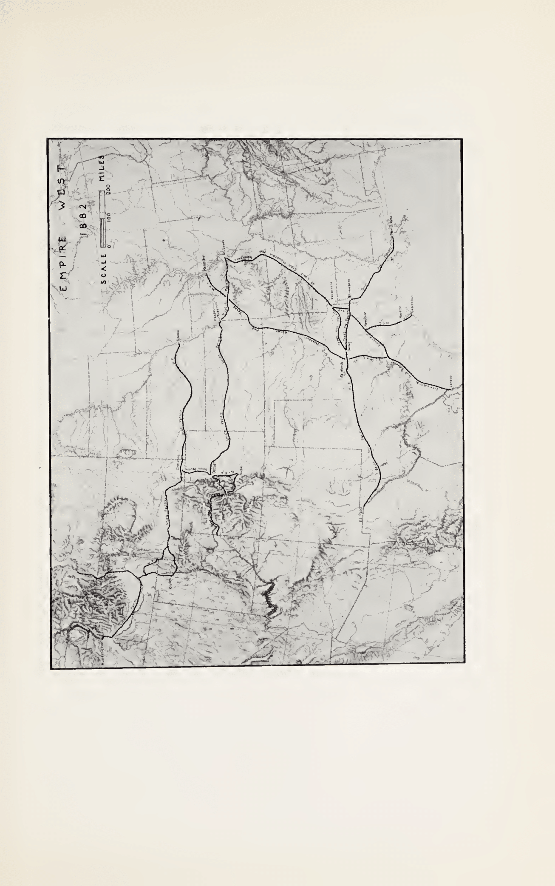

# Chapter XVII - Gould Creates Empire—West

In the West even more than in the East, many opportunities called for fundamental decisions of policy. This was particularly so in the building of new lines to open up territory rich in raw materials. In the Northwest as well as in the Southwest, the economic future of thousands of communities depended upon rail facilities. Of the promoters and capitalists who supplied this demand, Gould was in many respects the most important. He, as much as any other person in the early eighties, laid down the rails—the symbol at that time of a changing civilization.

Before he was well on his way in working out his western empire building policies, however, he executed a brilliant stroke of corporate strategy in the very center of his expanding system at St. Louis. In this way he enhanced his competitive strength and secured a controlling position in this vital terminal area. A bridge to connect St. Louis with East St. Louis across the Mississippi River was long considered a vital necessity. In 1868 the Illinois & St. Louis Bridge Company was formed to make this hope a reality, and in 1870 J. S. Morgan & Company of London bought $2,500,000 of its bonds with an option to buy the remaining $4,000,000 within thirty days. Of the amount issued, St. Louis subscribers took $1,200,000.[^018_1]

In addition to the bridge, a tunnel to connect with the railroads and a depot was also built. The tunnel was equipped with a steel double track and operated in connection with the bridge, and the latter guaranteed its interest and principal.[^018_2] Like so many other sound projects, this enterprise despite its inherent value was doomed to failure because of timing blunders. The bridge was built at the wrong time and incurred a heavy load of fixed charges on the basis of inflated prices. It began to do business when interest remained and business declined. The company soon paid the penalty of financial miscalculation: the interest was passed, receivers were appointed, the property was sold at foreclosure to a group representing the bondholders, and the stockholders were eliminated. New first mortgage bonds were exchanged for the old, and new preferred stock was issued for the junior bonds.[^018_3] The common stock of the new company—the St. Louis Bridge Company—was transferred to the committee on reorganization to be used in any way it thought necessary.[^018_4] The committee was controlled by the banking firm which originally sold the bonds.

By 1881 the earnings of the company were sufficient to cover interest charges and part of the preferred dividend. The property was of great strategic value to Gould's system. The Wabash lines from the east terminated at East St. Louis. The Missouri Pacific, soon to become the parent company of a group of railroads in the far-reaching stretches of the Southwest, terminated at St. Louis. Approximately 80 per cent of the freight carried by the bridge was interchanged for these two properties.[^018_5]

A pretty problem in corporation finance now emerged. Here was a bridge and a tunnel essential to Gould's roads. The reorganized companies had a bonded debt, while a banking firm held the stock for the benefit of the security holders. How could this property be purchased in behalf of the two railroad connections in such a way as to give Gould the controlling interest in the terminal facilities? To the lay observer the solution would appear to rest in the purchase of the stock from the reorganization committee. That solution, however, would require the purchaser—in this case Gould—to put up cash or other valuable consideration.

Gould, however, did not adopt such a simple device. Indeed, although he was anxious to acquire control, he made no overtures for the purchase of the stock. Instead, resorting to his threat technique, he announced that he was building a competitive bridge across the Mississippi forty-five miles above St. Louis at a point where the Wabash east-and-west lines could be connected by a short extension. The new line was advertised "as the most important link in a great transcontinental route."[^018_6] A charter for a bridge was requested from Congress and construction proceeded rapidly.

Gould's tactics were successful. The St. Louis Bridge Company surrendered, and Gould stopped construction on the competitive bridge. The Wabash investment in this line was impaired, and a few years later its receivers dropped it forthwith. The St. Louis bridge and tunnel properties were leased jointly to the Missouri Pacific and the Wabash, the lessees guaranteeing the interest on the relatively small issue of the first mortgage bonds as well as a dividend at the rate of 5 per cent on the first preferred for the first two years and 6 per cent thereafter, and 3 per cent on the second preferred.[^018_7] The lease guarantee contract made no reference to the common stock. Terms of the settlement were described by the London Morgan firm prosaically and somewhat wistfully as "somewhat less favorable than hoped"; but, in view of agitation for another bridge, the firm had no hesitation in recommending acceptance of these terms.[^018_8]

What did Gould personally secure? Apparently nothing, though as in the Erie-Vanderbilt settlement, actually he secured almost everything. In the St. Louis bridge deal, the bondholders of the old property received a return on their investment and Gould received the property; that is to say, the common stock. For this, presumably, he agreed to induce the directorates of the Wabash and the Missouri Pacific to become lessees of the bridge and tunnel properties and to pay the rent. The common stock had no earnings; indeed, based upon existing earnings it had a deficit value, though that was quickly changed. With a monopoly in a vital terminal area he could adjust the tolls for railroad interchange and transfer service on such a basis as to make the bridge company's common stock valuable.

The adverse results which flowed from this power became visible only gradually. In 1880 and 1881, however, Gould in the eyes of the citizens of St. Louis became "a sort of patron saint."[^018_9] In addition to the acquisition of his major transportation properties he undertook also the purchase of interests in a number of important industries in St. Louis.

Another St. Louis acquisition, vital to the city's prosperity, revolved around the Mississippi River barge transportation business. For years champions of water service had looked upon transportation down the Mississippi as a means of reducing rates. Gould acquired an interest in two of the barge companies and by the summer of 1881 succeeded in consolidating them into a new enterprise. Gould controlled five out of the nine members of the board. In view of the fact that the through eastbound freight rates from St. Louis and Chicago to New York had been adjusted by the settlement made in the spring of 1877, railroad rates appeared to be high. This factor combined with the large grain crop in 1879 and 1880 led to a revival of water transportation down the Mississippi.

Anticipation of prosperity for the water lines was soon disturbed by the succession of rate wars in eastern trunk-line territory which by the summer of 1884 reduced the rates on wheat and other commodities to new low levels.

While Gould was thus promoting so many business interests in St. Louis, his activities in other parts of his railroad empire in the West did not diminish. In fact it was there that Gould became for the first time in his career a great railroad builder. His building activities in the East were relatively unimportant, consisting mostly of connecting links in trunk-line railroads.

In 1880 and 1881, however, he emerged as one of the leading, and for more than a year, the leading railroad builder of the land. In the West he enlisted many millions of new capital for the building of roads, and many communities looked to him for their economic salvation. He also made heavy commitments in industries closely associated with railroads and other forms of transportation. To get an adequate supply of locomotive fuel he acquired interests in numerous coal mines. In Iowa and Illinois he and Sage organized coal ventures most of whose production was taken by the Wabash, and in the Indian Territory he organized another coal company which for a number of years not only supplied all the Texas railroads with coal but in addition sold a large tonnage in the commercial and non-railroad markets.[^018_10]

It was, however, primarily into the field of railroad building that Gould poured millions of his own money and the money of an army of followers. In the Far West the Union Pacific in 1879 had already entered upon its feeder-building policy which some years later was so sharply criticized as a major factor in the breakdown of its finances. A contrary policy, refusing to furnish transportation service to productive farm, forest, and mining areas would probably have promoted an even greater flood of criticism. Perhaps construction was carried out too hastily or in advance of actual traffic needs. The essential soundness of the policy, however, both to the railroads and to the public, cannot be fairly challenged.

In addition to the branch building policy, the Union Pacific in 1880 and 1881 entered upon an expansion program in the Northwest. In order to give the Union Pacific access to the Columbia Valley, a new company—the Oregon Short Line—was organized. Stockholders of the Union Pacific were given rights to buy one $1,000 (face value) bond, plus five shares of stock of the new company for $1,000. For a guarantee of the Short Line's bonds, the Union Pacific received one-half of the stock. The venture was one of the major construction programs of the early eighties. Eventually the line was turned over to the Union Pacific and proved to be a profitable addition, though for a few years it was a drag on earnings.

At the same time another extension into new and productive territory was undertaken. Some years before, a promoter had conceived the idea of building a new road from the main stem of the Union Pacific north to Butte, Montana, at that time the center of a rapidly growing copper industry. This road, the Utah & Northern, was originally built as a narrow-gauge line, and though still uncompleted in the fall of 1880, was described in the territory served "in the highest terms of its equipment and management."[^018_11] The leading spirit in its promotion, Colonel Joseph Richardson, ran out of funds just at the time when, because of the rapid increase in copper production, the unfinished road developed earning potentialities. Here was an opportunity too good for Gould to overlook. He and his associates on the Union Pacific agreed to buy the unfinished property and to supply the funds to complete construction. Richardson sold his interest in the property and in return received some of the bonds. To Gould this was a cheap price since, in effect, the property cost him nothing. He had the road create a bond issue, sold some bonds to raise funds to complete the extension and transferred a small block to Richardson. Two hundred and fifty miles of additional construction was then completed in the scheduled time of eight months.[^018_12] The construction of the line which had languished under an indigent proprietor was thus completed in short order under a prosperous successor. At about the same time the Union Pacific, to get a more direct route to Denver, built a Denver cut-off from the main line, thus enabling it to carry its Denver traffic more efficiently and at lower cost.

The cut-off was part of a general program of construction and expansion in central and eastern Colorado. By the fall of the year the road was in the midst of a program designed to penetrate the rich mining districts tributary to Denver. Early in 1880, as part of the settlement between the Denver and the Atchison, the Union Pacific had agreed not to build or promote the building of a parallel or competing line to the Rio Grande from its own lines above Denver to any point in Colorado south of Denver and the main east-and-west line of the Kansas Pacific. Nothing was said in the agreement about the South Park—the line which provided a short route from Denver into the Leadville mining regions. In the construction contest between the Denver and the South Park, personal enmities and bitter feuds had developed. An agreement in October, 1879, had appeared, however, to have achieved an equilibrium; the roads agreed to divide the business, and under a schedule of reasonable rates they would be able to earn a return upon their investment.

The two roads, however, did not reckon with Gould. In accordance with his usual skill in solving strategic problems of this character, he had wormed himself into a position of controlling importance in both the Denver and the South Park. His acquisition of the Denver stock has already been noted. Gould acquired the South Park's stock in a series of steps. In 1877 the South Park was short of cash. In that year the business depression was at its high and it was difficult to raise funds. Here Gould, acting through the Kansas Pacific, took South Park stock on behalf of that railroad in payment of freight bills for transportation services rendered to the South Park. Again Gould served as a source of speculative capital, and a part of the profit later made by selling the stock to the Union Pacific was in consideration of the speculative risk assumed in the depression period. Then, in 1879 through some patient planning, Gould secured another block, about one-fourth, of the South Park's stock. This acquisition was made in a trade with the stockholders of the controlling construction company. Personal and corporate interests were so intermixed that one finds it difficult to determine where the one interest begins and the other leaves off. Gould agreed that if the construction company sold him the South Park's stock, the Kansas Pacific and Union Pacific "would forebear certain discriminations" against the construction company. In December of that year Gould bought an additional number of shares from one of the Colorado counties.

The remaining South Park shares, except for a small amount owned by a New York investment banker, were placed in a pool, with instructions to the trustee to sell all or none. Before the end of 1879 the South Park had become profitable. Both Palmer for the Denver, and Gould on his own behalf, bid for the South Park stock. These bids were met by high asking prices. Gould finally (November, 1880) wired Evans, president of South Park and agent of the pool to which the citizens had trusteed their stock, to make an offer. The offer to sell at $100 per share was promptly accepted by Gould.[^018_13] A few weeks later Gould sold (at the same price) all the stock to the Union Pacific.

To the lay observer it might occur that with Gould interested in both the Union Pacific and the Denver, a period of peace would follow. One would be justified in drawing such a conclusion from the terms of the territorial agreement of 1880 which had forbidden the Union Pacific to build south into the territory of the Denver. No such peaceful interlude occurred. The Union Pacific declared that the agreement did not prevent it from expanding. True, the agreement did enjoin the Union Pacific from taking such action, but it did not mention the South Park. It was not the Union Pacific which would build into the Denver's territory; it was the South Park that would do so.

By early summer of 1881 the battle was again joined. The Union Pacific through the South Park and another subsidiary surrounded and tapped the Denver at all important points, including Leadville. The Denver retaliated and not only built into Union Pacific territory, but also took extraordinary steps to prevent that road from getting into Leadville proper.

These construction programs in Colorado and Utah, although charged with dramatic interest, were nevertheless local in character. It was in the Southwest that Gould's construction program blossomed and flowered in all its imperial glory. There the main lines of development were still unfinished. Railroad tracks did not extend to the natural termini which the trade and commerce of the country and of its neighbor, the Republic of Mexico, required.

In this region Gould initiated his program almost immediately after he acquired control. The population and wealth of the Southwest were then rapidly increasing. "'South-westward the star of empire wends its way,"[^018_14] remarked one observer. Gould recognized the opportunity to pre-empt desirable traffic-producing territory and laid his plans with almost dazzling speed. Through his general manager, he announced in February, 1881, his intention to build more than 900 miles of track before the end of the year. About half would be built in Missouri and Kansas, and the other half in Texas.[^018_15]

Another campaign of construction was projected in Arkansas. At the close of 1879 the state had less than 500 miles of railroad. No sooner did Gould acquire control of the Iron Mountain than he called a stockholders' meeting to approve his plans for new construction. The meeting approved an increase of the company's debt and a contract with a construction company. Gould's rapid-fire action made a deep impression. One board member declared in a burst of enthusiasm: "The road has suffered long for the want of branch lines, and it is now proposed to secure them. This is one of the results of placing live men in the directory. Those western men are able enough, but so very slow."[^018_16]

It was in the vast stretches of central and southern Texas, however, that Gould's projects made the deepest impression on contemporary economic life and on the growth of American railroads. Two competitive lines—the Kansas & Texas and the International—which had nurtured ambitions many years before to build connections with the Rio Grande, were by 1880 in the control of Gould. Within less than a month after he took charge, he began a program which soon fulfilled the ardent hopes of their early promoters and the yearning desires of the people for new railroad facilities. A few days after the court authorized the return of the property to its shareholders, the Kansas & Texas called a special stockholders' meeting. The outstanding stock was increased to $25,000,000, and the Gould policy to extend the road 500 miles to Laredo on the Rio Grande was approved. The money needed to finance the program was quickly subscribed.[^018_17]

Gould had now perfected a physical union of all his southwestern lines, and controlled alternative north-and-south routes to northwestern markets. Adverse interests therefore became inevitable since traffic that moved over one route was bound to benefit one road and hurt another. Gould could select that route which benefited himself and his favored railroad most, and this is precisely what he later did.

While he was planning these lines between Kansas, Missouri, and Texas, he prosecuted with even greater energy the building of the El Paso line of the Texas & Pacific. In this wild building rush into and through the Southwest, Gould finally stubbed his toe. He met and failed to overcome the determined opposition of that great American builder and borrower, Huntington. It is a question whether the present generation has succeeded in overcoming the clouds of suspicion and exaggeration overhanging Huntington's business career, engendered by bitter political and newspaper attacks on his business monopoly in California, to a point sufficient to recognize his work as the leading railroad builder in American history. Huntington was the cart horse of the vast Central Pacific-Southern Pacific system. He called himself vice president, and permitted Leland Stanford to serve as president. Stanford was the smooth talker, the publicity agent, and the mouthpiece of Huntington and his associates. Huntington, however, was the driving factor and the creative genius that built more miles of railroad in the United States than any other individual. He was also the financier. By personal credit and by transferring loans from bank to bank and from person to person, he succeeded in financing the only single major railroad construction program in the depression of the seventies. Furthermore, by continuing to pay dividends for most of those years on more than $50,000,000 of Central Pacific stock representing only a slight cash investment, he succeeded in accomplishing that which only a handful of others were able to do. He succeeded also in buying up practically every railroad competitor in California, and in acquiring at almost nominal cost the control of all railroad approaches as well as almost all the waterfront terminal facilities of the San Francisco area.

In 1881 he, like Gould, was building rapidly. He was then rushing to completion the Southern Pacific lines from the Colorado River to El Paso. For some years T. W. Pierce, a promoter and capitalist (connected neither with Huntington nor Gould), had been energetically prosecuting other plans for the building of a through line between eastern Texas and El Paso. It was expected that this line when completed would have close business relations with the Texas & Pacific, and in some quarters a merger between the two companies was contemplated.[^018_18] When therefore in the summer of 1881 it appeared likely that Huntington would join with Pierce and other groups in building and expanding into southeastern Texas and Louisiana, Gould sensed the danger. Huntington might move all the way east to New Orleans, or even worse, northeast into Gould's territory.

Gould recognized the character of the opposition. He knew Huntington; he had previously negotiated with him. He therefore did not hesitate; he did not wait; he issued no threats; he well knew that threats had little meaning to a man of Huntington's rugged character; he arranged no parleys, and he called no conferences.

The major Pierce railroad property—the Galveston, Harrisburg & San Antonio (in July, 1881, Huntington bought control of this property)—terminated on the west at San Antonio. When Gould, in February of 1881 through the International, began to build west, the Pierce road followed suit. After duplicating each other's lines for about twenty-five miles the tracks diverged. Gould saw no purpose in following the other road west to El Paso, thus duplicating Texas & Pacific in which he had such a large interest. When therefore he headed straight for Laredo on the Rio Grande while his competitor moved north and west to El Paso, Gould decided to act in the interests of the southwestern system as a whole and to ignore the separate interests of each road. Since the International was building one line to the Rio Grande, a line of the Kansas & Texas to the same area would be an economic waste. A special shareholders' meeting called to approve the change in the latter's extension program produced no opposition. Building on the Kansas & Texas was stopped at a small point in Texas, many miles short of its goal on the Rio Grande. The system was benefited but the Kansas & Texas was hurt. Representatives of the road seven years later criticized the action, but in 1881 it was approved and any potential future danger was lost sight of in the enthusiasm of the moment.

While Gould was thus successful in solving his internal system problems, he became acutely aware of the growing danger arising from the Huntington-Pierce moves. For the first time since his clash with Cornelius Vanderbilt in 1868, he had encountered an aggressor who asked for no terms and sought no settlement. Gould instead of seizing the offensive was compelled to search for defense weapons. He first looked for a flaw in the Huntington set-up. The Southern Pacific was building roads under territorial law but through land covered by a grant given by Congress to the Texas & Pacific. The Supreme Court of New Mexico, therefore, granted Gould's Texas & Pacific a temporary injunction to restrain the Southern Pacific from operating approximately 130 miles and to recover that part of the road built through the land embraced in the grant to the Texas & Pacific.[^018_19] Since the Southern Pacific stock was held by Huntington and his associates, Gould's favorite battle ground—the New York stock market—was of no use. He therefore resorted to his other club of compulsion—the building of parallel and duplicate lines.

Toward the end of the summer he massed his forces for invasion of the enemy's territory. It was truly an imposing aggregation of properties which he proposed to unite. To retaliate against Huntington's move into Texas and Louisiana, he planned to move into California. He consolidated his forces first on the western end of the Union Pacific. From the end of a small Union Pacific controlled road in southern Utah—the Utah Central—he planned to build west.[^018_20] Far to the west the Union Pacific acquired control of a small road—the California Central—with a right of way into San Francisco, thus promising to give Huntington's Central Pacific its first competition in that city. Through a number of new companies, in effect divisions of the California Central, the latter would be extended to the Nevada boundary line, there to connect with the western extension of the Utah Central. Through these lines and extensions Gould's Union Pacific would have a line to San Francisco independent of Huntington's Central Pacific.

These arrangements, far-reaching as they were, by no means represented the climax of Gould's plans. He proposed to unite in one combination all the other roads with transcontinental ambitions. As potential transcontinental roads, they were potential competitors of the Union Pacific, but Gould proposed to make them friends. One, the Texas & Pacific, was building rapidly west to El Paso, there to connect with the Atchison. Over the latter and over one of its affiliates by trackage rights, the Colorado River could be reached. In the last week in August, 1881, Gould finally proposed an agreement for the grand alliance directed against the Central Pacific—Southern Pacific's California monopoly. Included were the Texas & Pacific, the Atchison, the Atlantic & Pacific (the Atchison's affiliate), and the Union Pacific.

Here was the first vital threat in Huntington's business experience to his Pacific Coast monopoly. However, he did not flinch. Yankee realist that he was, he made no appeasing gestures. He moved quickly, by sending out parties to survey a duplicate line east of Ogden. Huntington preferred a connection with the Burlington, while C. F. Crocker, a Central Pacific vice president, insisted upon a more northerly approach via the Northern Pacific.[^018_21] It was believed that the new road could be built at a cost of one-third that of the Union Pacific. As soon as the Union Pacific and its allies moved west of Ogden to parallel the Central Pacific, Huntington made it clear that the Central Pacific would move east of Ogden to parallel the Union Pacific. The Union Pacific, declared Huntington, had been "cavorting" around too much in the West. "Their people have gone in our bailiwick," and they don't belong there, he concluded.[^018_22] Gould's transcontinental ambition was frustrated. He was then heavily involved in many unfinished railroad and market operations. The eastward extension of Huntington's lines into trans-Missouri territory would precipitate rate wars, reduce the earnings of his Texas & Pacific, and upset local rates in many parts of his southwestern system. Gould realized that he had met a man of tested mettle, of financial strength and of independent character. Huntington was supported by the energetic Crocker, vice president of the Central Pacific. Give Dillon "pretty square talk and tell him that all this stuff and talk about building parallel to us will not be tolerated."[^018_23] And toward Gould, Crocker advised Huntington "to do more watching than 'praying.'"[^018_24]

The negotiations for a settlement were carried on in Huntington's office in New York between Huntington, Gould, Sage, and Dillon. These rivals soon composed their differences. Huntington joined the Western Union board, thus becoming, momentarily at least, a Gould ally. What is more important an agreement was reached that appeared to harmonize the competitive relationships of their respective properties.

The agreement reached in November, 1881, was one of the most famous of its kind. Huntington had already built ninety miles east of El Paso, and it was agreed that the Southern Pacific and Texas & Pacific would use this stretch on equal terms. The gross from the Pacific Coast through business would be shared by the Texas & Pacific and the Huntington lines. Huntington would complete this road south and east from El Paso and agreed not to build north and east from that point. The Texas & Pacific relinquished its claim to its land grant, right of way and franchises west of El Paso to the Southern Pacific. So long as the agreement was fulfilled, the Texas & Pacific promised not to extend its road west of El Paso. Similarly, the Southern Pacific agreed, subject to the same condition, not to parallel the Texas & Pacific east of El Paso.[^018_25]

For Gould it was a defensive move. It protected his Texas & Pacific while it also gave him the opportunity to share in the business to the Pacific Coast. In return he gave Huntington the opportunity to share in the business to New Orleans, then served from the west only by the Texas & Pacific. The restrictions on the territorial expansion of both the Southern Pacific and the Texas & Pacific permanently modified the railroad map of the Southwest. Huntington never pushed ahead with any extensions from El Paso north and east. Similarly the Texas & Pacific never built west of El Paso.

The agreement between Gould and Huntington for the division of traffic between New Orleans and the Pacific Coast lasted as long as the business of the two parties made it wise to do so. Like so many diplomatic agreements, the arrangement proved to be no more than an armistice. It provided a waiting period during which both contestants resumed their business and construction plans unimpeded by the other's threats or counter-threats. The agreement did not deter Huntington from completing two years later a new through route to New Orleans by which he turned the flank of the Texas & Pacific. Huntington thereby exerted an important force in the middle eighties in breaking up the finances and earning power of the Texas & Pacific.

This outcome, however, was not then anticipated in any quarter. Financial judgment did not look forward to any adverse results. The union of the Gould-Huntington interests was expected to boom the business of the Texas & Pacific. In Philadelphia, a city in which through the activities of (T. A.) Scott heavy investments were made in the road, the expectations were expressed in optimistic language. One of the leading papers declared flatly that the agreement would "soon more than double the present earnings."[^018_26] A lengthy description of the property in Gould's New York press organ was climaxed by the assertion that "immense traffic" in California breadstuffs would move over it to New Orleans.[^018_27] Field in one of his voluble moments misled his followers, and presumably himself as well, by waxing enthusiastic over the new route. Its possibilities, he said in his personal press organ, could "scarcely be over-estimated."[^018_28]

The optimism bubbled over into the stock market. In heavy volume the price of the Texas & Pacific in a weak market rose substantially. Activity at these elevated prices facilitated the sale of Gould's holdings. Prices registered at that time were not again to be duplicated in Gould's lifetime. Much if not all of the stock which he then sold he later repurchased, and at critical times he managed to keep sufficient of the stock to retain control, even through financial reorganization.

The vast Gould program, part of which led to the contest with Huntington, was in geographical scope, in the number of individual railroad companies, and in the speed with which construction was carried on simultaneously in so many sections of the country, unprecedented in American life. He had now for the first time in his career the opportunity to profit from railroad building.

Profits from this source had for many years been realized through construction companies. The construction company was an old device. In return for the railroad's stocks and bonds, the construction company agreed to build the road, whereupon it made arrangements with contracting firms to do the actual building. Usually the par value of the securities paid by the railroad to the construction company substantially exceeded the cost of construction. Normally the bonds raised the required funds; the stock represented consideration for promotion services. After the line was completed and the construction company dissolved, the latter declared a liquidating dividend payable in its assets—those assets consisting usually of all or at least a large part of the stocks of the railroad company. In this way the stockholders of the construction company with only a small cash outlay secured control of the railroad company.

The earlier companies found it difficult to sell their stock to outsiders. Between 1873 and 1879 there was little construction and few construction companies. It was Gould who was responsible for their increased use in the late seventies and early eighties.

Gould carried the construction-company device to greater lengths than ever before. First, he made an active market for its stock, something which Huntington, for example, had never been able to do. Second, he used the stockholders of his railroad companies as a means of floating the stocks of his construction companies. He sold rights to buy the securities, either of the construction companies or of the railroads. The ventures were profitable and Gould thus increased his speculative following. He made profits for himself, and at the same time enabled those who accepted the subscription privileges to make profits also.

His first important venture into this field was unusually successful. The Pacific Railway Improvement Company contracted to build the Rio Grande division of the Texas & Pacific between Fort Worth and El Paso. Gould succeeded in attracting to the board of this construction company not only his permanent associates, Sage and Dillon, but also Huntington. Shortly thereafter he brought out the stock of the American Railway Improvement Company which had the contract for the Texas & Pacific's New Orleans extension. The first company having proved so profitable, Gould found little difficulty in attracting a following for a new one. Subscribers included capitalists from New York, Philadelphia, and Baltimore.[^018_29] The stock was offered for subscription not only to the stockholders of the Texas & Pacific, but also to those of the Kansas & Texas and the Missouri-Pacific.

By the summer of 1881 the stocks of both construction companies had advanced to high levels. The Pacific Railway Improvement was quoted at $260, a premium apparently due to the fact that the work of construction was expected to last for several years. Events soon proved this to be a false hope, since the line to El Paso which was scheduled for completion in the fall of 1883 was in fact never built to its destination. Owing to the aggressive eastward building program of Huntington, the El Paso extension was constructed much faster than anticipated, and by fall the building program was over. The stock of the American Railway Improvement also proved a bonanza. In the summer of 1881 it was quoted from $215 to $225 a share—a substantial premium.

Another company, the International Railway Improvement, took over the building program in Texas of the International and of the Kansas & Texas. This company was also profitable. Upon liquidation within less than a year after its organization, it paid a dividend of 25 per cent in bonds of the Kansas & Texas, even though only 60 per cent of the stock was paid in. The profits were "remarkably large," declared Field, by this time a confirmed Gould follower.[^018_30]

In the East the expansion program of the Lackawanna was also carried out through the medium of a construction company. A few months after its organization the shares of this company, the Central Railway Construction, were quoted at a 40 per cent premium above par.[^018_31] Field's press organ again hailed the speculative hero, and described this construction company stock as the best subscription on the list.[^018_32]

Examination of the famous Gould empire of 1881 is thus concluded. It was an empire built around Gould's personality, and not necessarily around his stockholdings in each road. Whether he held a majority or minority interest, or no interest at all, his influence was predominant. His was the decisive word in the determination of major corporate policies. It is, therefore, sound to conclude, regardless of the number of shares which Gould personally held, that he was master of their destinies. In control of this vast system of railroads, terminals, bridges, and of telegraph lines, of elevated street railroads, of river and lake transportation, to say nothing of his miscellaneous industrial enterprises, Gould was one of the decisive factors in American business life. An idea of his far-reaching influence in the railroad industry alone can be realized from the following computation showing his railroad empire at its peak at the end of 1881.

Gould's Railroad Empire, December 31, 1881

| Railroad | Miles |
|---------|------|
| Central of New Jersey | 557 |
| Delaware, Lackawanna & Western | 776 |
| Denver & Rio Grande | 1,065 |
| International Great Northern | 776 |
| Missouri, Kansas & Texas | 1,286 |
| Missouri Pacific | 904 |
| New York & New England | 478 |
| St. Louis, Iron Mountain & Southern | 723 |
| Texas & Pacific | 1,392 |
| Union Pacific | 4,269 |
| Utah Central | 280 |
| Wabash | 3,348 |
| **Total** | **15,854** |

Total miles in country: 104,813[^018_33]

The mileage represented 15 per cent of the mileage of the country's railroads. Not until the days of E. H. Harriman, twenty-five years later, was any railroad system established with the same relative importance in mileage. Gould, however, had another property—the Western Union—which exerted an influence as great as did the railroads in their respective spheres. Through its contracts with the country's railroads, the Western Union made large-scale competition difficult and expensive. His control of the Manhattan in New York City was also made complete in 1887, when the removal of Field left no one on the board to oppose his policies.

This system was established in little more than two and a half years. In the fall of 1878 his hold on the Union Pacific was shaky. Though he held a substantial percentage of Union Pacific stock, he could not liquidate his holdings. Through the skillful use of a relatively small sum raised by the syndicate sale of this stock, he laid the foundation in the next few months for the country's most extensive and diversified corporate empire. In point of control over the corporate and business life of the country, Gould had no equal. His empire of control was not a permanent arrangement. Many parts of the corporate fabric were weak; others were indeed not integral parts at all; still others were bought for speculative and stock-market purposes. Many shrewd observers in succeeding months insisted that no part of this far-flung empire was bought with any permanent purpose in mind.

Nevertheless at its peak in 1881 it gave Gould unprecedented financial power; and to other observers he seemed, in the few years following the establishment of this empire, to be the country's uncrowned business dictator.

As the year 1881 passed on into the pages of history, Gould was by no means ready to sit back and rest. He was deeply involved in trading operations. Misjudging the trends of the markets from the summer of 1881 on, he adopted a trading strategy that almost resulted in disaster.It was not long after the end of the brilliant year of 1881 that, in recognition of his overexpanded position, he began to contract his corporate system, to sell out here and there, to reduce his obligations, and to cut his losses, and in other cases to cash in on his gains. In other parts of his system he expanded continuously. Both in the East and in the West, and in the wide stretches of the Southwest, he came into repeated conflicts with existing companies and railroad systems, and with towering and aggressive personalities. In these conflicts he was by no means successful. In some cases he lost heavily, and in others he won. Regardless of immediate results, however, he exercised a commanding influence in the country's financial, business, and economic life.

---

## Notes for Chapter XVII

[^018_1]: Am. R. R. Journal, April 9, 1870, 400.
[^018_2]: R. R. Gaz., Aug. 1, 1874, 297.
[^018_3]: Ibid., Dec. 27, 1878, 629.
[^018_4]: Herapath's Ry. Journal, June 25, 1881, 778.
[^018_5]: R. R. Gaz., July 8, 1881, 375.
[^018_6]: New York Times, March 11, 1889.
[^018_7]: The terms of the contract are given in Chron., June 18, 1881, 659; and in R. R. Gaz., July 8, 1881, 375.
[^018_8]: Herapath's Ry. Journal, Aug. 13, 1881, 999.
[^018_9]: This is the expression used editorially in Phila. Press, April 6, 1881.
[^018_10]: Phila. North American, May 31, 1883.
[^018_11]: Am. R. R. Journal, Oct. 16, 1880, 1147.
[^018_12]: This account of the Utah & Northern is based upon the Phila. North American, Nov. 8, 1880; and United States Pacific Railway Commission, Testimony, Executive Document No. 51, Senate, 50th Congress, 1st Session, 1887, 2173, John Sharp.
[^018_13]: Ibid., 1851-4, Evans.
[^018_14]: Ry. World, Dec. 15, 1880, 1226.
[^018_15]: This program is described in detail in the St. Louis Republican, cited in Ry. Review, Feb. 12, 1881, 87.
[^018_16]: New York Tribune, Jan. 8, 1881.
[^018_17]: Ry. World, Nov. 20, 1880, 1113.
[^018_18]: This is the opinion expressed, for example, in Ry. Review, April 17, 1880, 184.
[^018_19]: Ry. World, June 11, 1881, 564.
[^018_20]: Crocker to Huntington, Oct. 7, 1881, M. M.
[^018_21]: Ibid., Aug. 5, 1881, M. M.; the Northwestern also offered a route over one of its Missouri Valley lines, Crocker to Huntington, Oct. 8, 1881, M. M.
[^018_22]: Ry. Review, Sept. 24, 1881, 535.
[^018_23]: Crocker to Huntington, Sept. 30, 1881, M. M.
[^018_24]: Ibid., no date, but written some time in October, 1881, M. M.
[^018_25]: See No. 62, House of Representatives, Committee on Public Lands, 48th Congress, 1st Session, 1884, for details on the Texas & Pacific Land-Grant and the Gould-Huntington agreement.
[^018_26]: Phila. North American, Nov. 5, 1881.
[^018_27]: New York World, Dec. 18, 1881.
[^018_28]: New York Evening Mail & Express, Nov. 17, 1881.
[^018_29]: A list of principal subscribers to the stock of the American Railway and Improvement Co. is found in the Dodge papers in the Iowa State Historical Society, Des Moines, Iowa.
[^018_30]: New York Evening Mail & Express, Oct. 6, 1881.
[^018_31]: Prices of construction company shares are taken from Bradstreet, Aug. 6, 1881, 82.
[^018_32]: New York Evening Mail & Express, Oct. 26, 1881.
[^018_33]: Mileage from Poor's Manual of Railroads, 1882.

*Empire West, 1882*
